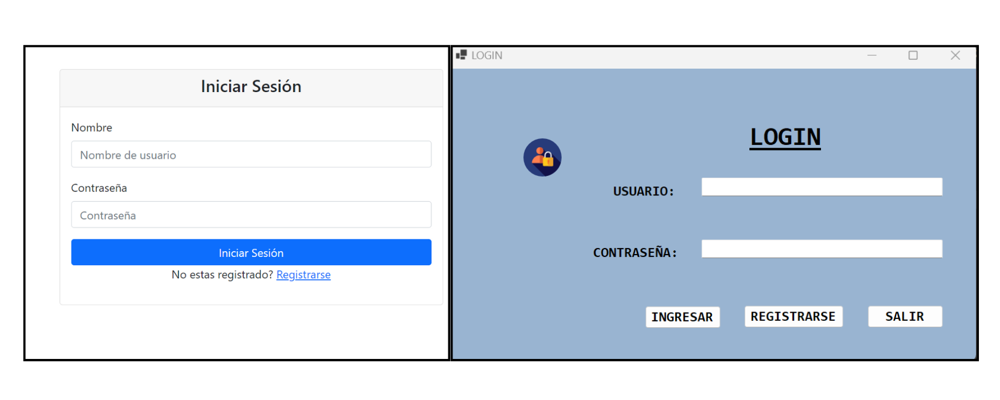
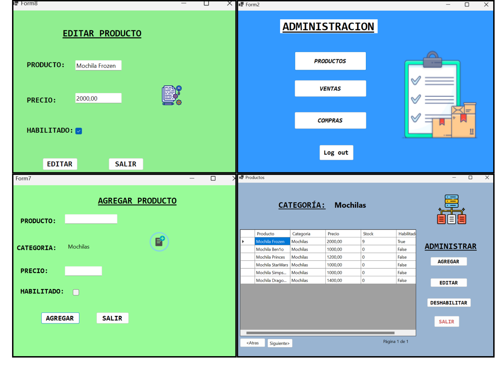

# Proyecto : Gestión de Stock
* Carrera: Tecnicatura  Universitaria en Programación.
* Asignaturas: Programacion 3 y Laboratorio 3.
* Intitución: Universidad Tecnológica Nacional, Facultad Regional Resitencia.

## Requerimientos Funcionales

- Como usuario del sistema deseo poder ingresar mediante credenciales (Solamente se debe guardar el hash del password de usuario con un salt diferente para cada uno)
- En la aplicación de Winform/Consola se deberá tener para poder gestionar los productos (ABM de productos) Cada producto tiene una categoría.
- No debe poder existir productos con el mismo nombre
- En la aplicación web se deberá poder registrar una compra, seleccionando el producto, la fecha e ingresando la cantidad
- En la aplicación web se debe poder visualizar las compras
La fecha de la compra no puede ser más allá de 7 dias para atras, y no pueden cargarse compras futuras
- En la aplicación web se debe poder cargar las ventas, seleccionando el producto y cargando la cantidad (las ventas solo se pueden registrar sin seleccionar fecha, toma la fecha actual)
- En las ventas no se puede realizar con cantidad que dejen al stock en negativo
- En la aplicación web se debe poder visualizar las ventas en un listado
- En la API se deberá consultar el stock de un producto
 (Ejemplo: /api/producto/123/stock)
- El stock es la suma de las compras menos las ventas

## Tecnologías Utilizadas: 
* Lenguajes: C#, HTML, CSS
* Acceso a Datos: Entity Framework Core y Sql Server.
* GUI: Winforms (aplicacion de escritorio), Razor Pages (web).
* Frameworks y biliotecas: ASP.NET MVC, Web API, Bootstrap.

#### Login weeb y winform:

#### Web

#### Winform

